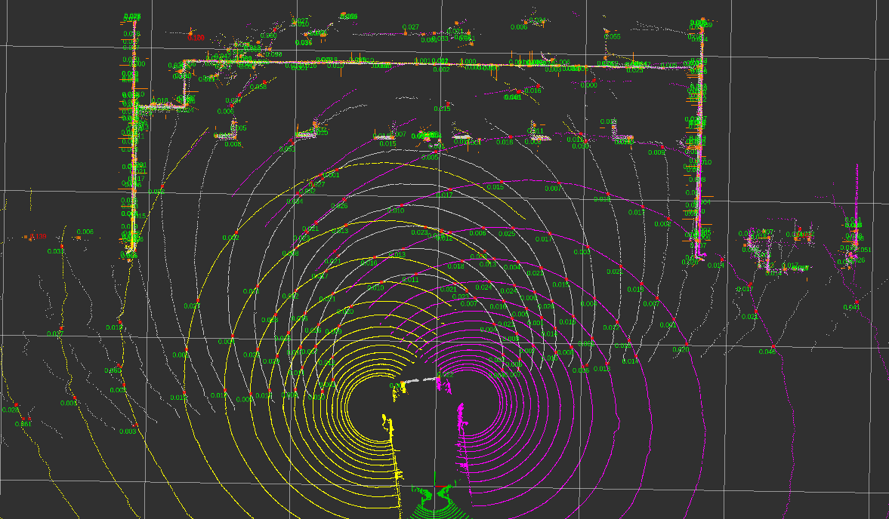
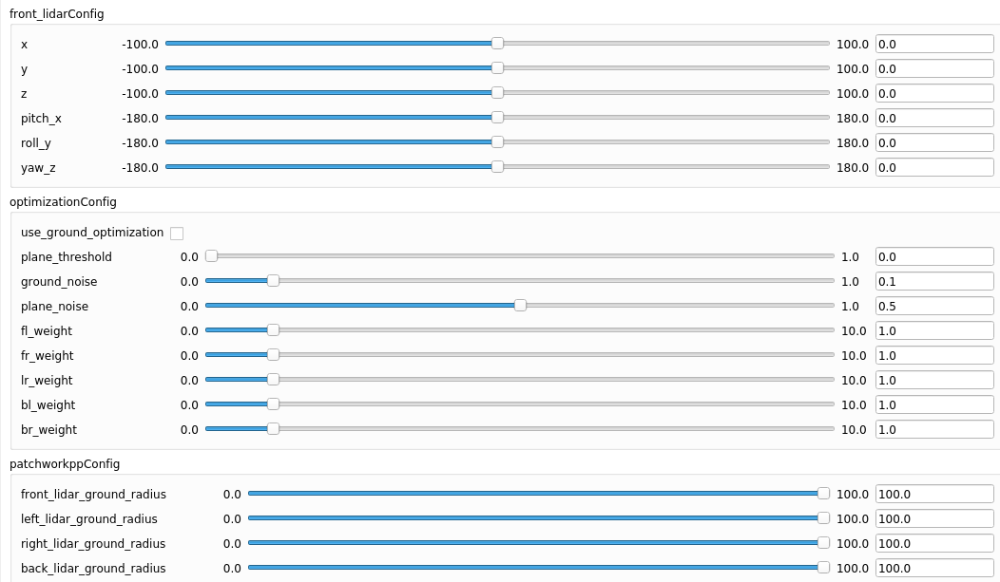

# Multi-LiDAR Calibration

语言: [EN](README.md) | [中文](README_ZH.md)

This method introduces an initial-guess-free automatic calibration algorithm for multiple LiDAR sensors with overlapping fields of view (FoV). It supports simultaneous extrinsic calibration of all LiDARs by leveraging geometric constraints from shared environments, such as ground planes or vertical surfaces, without relying on external positioning systems or manual initialization. Designed for large-scale multi-LiDAR systems or re-calibration scenarios after partial sensor relocation, the method features high automation, robustness, and scalability.



---

## 1. Dependencies

### 1.1 Ubuntu & ROS

- **ROS**
- **GTSAM 4.2**  
  Please follow the installation guide on the [GTSAM GitHub page](https://github.com/borglab/gtsam).

### 1.2 Required Packages

- **Eigen** ≥ 3.3.4  
- **PCL** (Point Cloud Library) ≥ 1.8
- **YAML-CPP**

---

## 2. Build


### 2.1 Build form source

```bash
mkdir -p catkin_ws/src
cd catkin_ws/src
git clone https://github.com/GDTR12/ml_calibration.git
cd ml_calibration
git submodule update --init --recursive
cd ../..
catkin_make
```

---


### 2.2. Build with Docker

```bash
mkdir -p catkin_ws/src
cd catkin_ws/src
git clone https://github.com/GDTR12/ml_calibration.git
cd ml_calibration
git submodule update --init --recursive
```

**Options 1**: Build from base image of ros-noetic
```bash
bash ./docker_build_base.sh <your_processes_number>
catkin_make
```

**Options 2**: Build from our image on dockerhub
```bash
bash ./docker_build.sh
catkin_make
```

---

## 3. Run

```bash
source devel/setup.bash
```

Put your ROS bag files into a folder, then modify the `bag_files` item in the [configuration file](config/multi_scene_calib.yaml).

In our demo setup:

- `"bag0"` (e.g., `lidar_front.bag`) and `"bag1"` (e.g., `lidar_back.bag`) should contain the LiDAR topics listed in `lidar_topics`.
- `lidar_front.bag` should include overlapping fields of view (FoV) between:  
  `{front <-> left, front <-> right, left <-> right}`
- `lidar_back.bag` should include overlapping FoV between:  
  `{back <-> left, back <-> right}`

---

### 3.1. Run in Recalibration Mode

This mode recalibrates **all LiDARs relative to the front LiDAR**.

- set `fix_front`(root lidar) in config file be `true`.

```bash
roslaunch ml_calib multi_scene_calib.launch recalibration_mode:=1 bag_folder_path:=<folder>
```

> Replace `<folder>` with the path to your bag files directory.

---

### 3.2. Run in Fixed-LiDAR Mode

This mode is for systems **already calibrated**, where **only some LiDARs have changed position** and require re-calibration.

- Provide the known transformation matrices for each LiDAR in the config file (e.g., `front_pose`, `left_pose`, etc.).
- Use flags like `fix_front: true` to indicate which LiDARs are fixed and which require calibration.

```bash
roslaunch ml_calib multi_scene_calib.launch recalibration_mode:=0 bag_folder_path:=<folder>
```

---

## 4. Fine-tuning in Challenging Scenes

The system may not always work reliably in all scenarios. To improve robustness, several ROS parameters are exposed for tuning:



- `front_lidarConfig`: configure the extrinsic parameters of the front/root LiDAR relative to the map.
- `optimizationConfig`: optimization settings to improve calibration quality:

### 4.1. Key Parameters

- **`use_ground_optimization`**  
  Use only ground constraints for optimization.

- **`plane_threshold`**  
  Threshold for plane fitting. If the environment contains many non-planar features, increase this value.

- **`ground_noise` / `plane_noise`**  
  Define the noise levels for ground and plane constraints. For more accurate ground alignment, decrease `ground_noise`.

- **`fl_weight` ~ `br_weight`**  
  Optimization weights for each LiDAR pair, such as front <-> left (`fl_weight`) and back <-> right (`br_weight`).

- **`front_lidar_ground_radius` ~ `back_lidar_ground_radius`**  
  Radius used for ground plane extraction from the respective LiDARs.

---

### 4.2 Troubleshooting Tips

- If **plane fitting fails**, it may be due to a **low `plane_threshold`**. Try increasing it to allow the algorithm to converge, then reduce it later for better precision.

- If **ground constraints** yield poor results, enable `use_ground_optimization` and try **reducing `xxx_lidar_ground_radius`** (e.g., `front_lidar_ground_radius`) to improve convergence.

# 5. Knowledgement

- [G3Reg](https://github.com/HKUST-Aerial-Robotics/G3Reg.git) The method refers the initial value for joint optimization.
- [Patchwokpp](https://github.com/url-kaist/patchwork-plusplus.git) The method refers the method for ground extraction.

