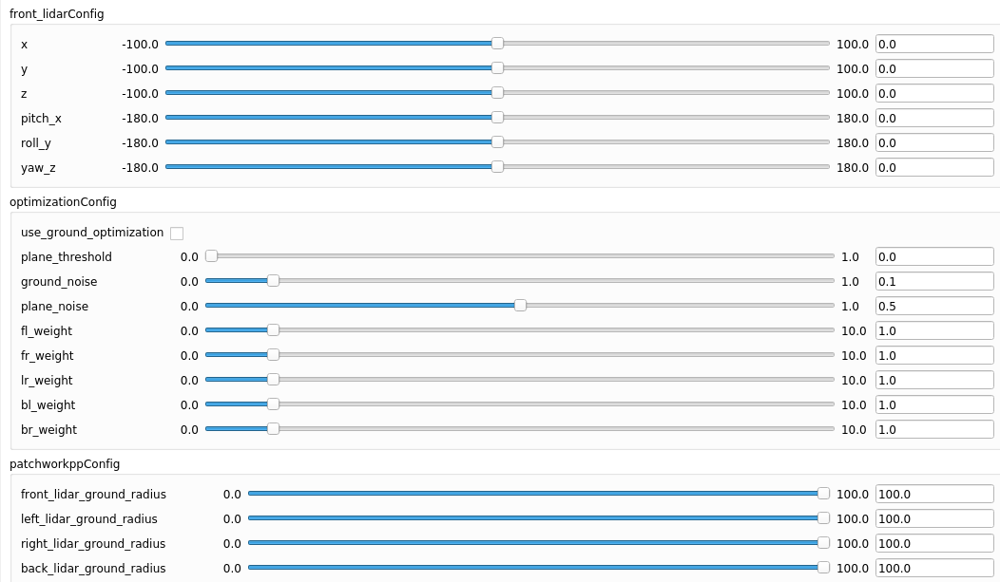

# 多激光雷达自动标定系统

Lanuage: [EN](README.md) | [中文](README_ZH.md)

本项目贡献了一种无需初始外参的多激光雷达自动标定算法，支持多个具有视场重叠（FoV）关系的激光雷达同时进行标定。通过利用重叠区域的几何特征约束（如地面、墙面等），系统可在不依赖外部定位系统或人工提供初始姿态的前提下，自动优化各雷达之间的外参变换关系。该方法特别适用于大规模激光雷达阵列或已部署但部分设备位置变动的系统，具有高度的自动化、鲁棒性和可扩展性。


---

## 1. 依赖项

### 1.1 Ubuntu 与 ROS

- **ROS**
- **GTSAM 4.2**  
  请参考 [GTSAM 官方安装指南](https://github.com/borglab/gtsam) 进行安装。

### 1.2 所需软件包

- **Eigen** ≥ 3.3.4  
- **PCL**（点云库） ≥ 1.10
- **YAML-CPP**

---

## 2. 编译

### 2.1. 为你自己的环境编译

```bash
mkdir -p catkin_ws/src
cd catkin_ws/src
git clone https://github.com/GDTR12/ml_calibration.git
cd ml_calibration
git submodule update --init --recursive
cd ../..
catkin_make
```

### 2.2. 从Docker构建

```bash
mkdir -p catkin_ws/src
cd catkin_ws/src
git clone https://github.com/GDTR12/ml_calibration.git
cd ml_calibration
git submodule update --init --recursive
```

**Options 1**: Build from base image of ros-noetic
```bash
bash ./docker_build_base.sh <your_processes_number>
catkin_make
```

**Options 2**: Build from our image on dockerhub
```bash
bash ./docker_build.sh
catkin_make
```

---

## 3. 运行

```bash
source devel/setup.bash
```

将你的 ROS bag 文件放入某个文件夹中，并修改配置文件 [config/multi_scene_calib.yaml](config/multi_scene_calib.yaml) 中的 `bag_files` 项。

在本示例中：

- `"bag0"`（如 `lidar_front.bag`）和 `"bag1"`（如 `lidar_back.bag`）应包含配置文件中 `lidar_topics` 指定的激光雷达话题；
- `lidar_front.bag` 应覆盖如下视场（FoV）重叠区域：  
  `{前 <-> 左，前 <-> 右，左 <-> 右}`
- `lidar_back.bag` 应包含如下视场重叠区域：  
  `{后 <-> 左，后 <-> 右}`

---

### 3.1. 重标定模式运行

此模式用于将**所有雷达重新标定到前向雷达坐标系下**。
- 需要设置 `fix_front`(根雷达)为 `true`
```bash
roslaunch ml_calib multi_scene_calib.launch recalibration_mode:=1 bag_folder_path:=<folder>
```

> 请将 `<folder>` 替换为存放 bag 文件的文件夹路径。

---

### 3.2. 已标定系统修正模式运行

此模式适用于系统**已经完成标定**，但由于某些原因部分激光雷达位置发生变化，需要重新标定其外参。

- 将每个激光雷达的已知外参填入配置文件中对应的位置（如 `front_pose`, `left_pose` 等）；
- 设置对应 `fix_***` 项（例如 `fix_front: true`）为 `true`，以指明该雷达位置已发生变化。

```bash
roslaunch ml_calib multi_scene_calib.launch recalibration_mode:=0 bag_folder_path:=<folder>
```

---

## 4. 复杂场景下的参数调整

该系统在复杂场景下可能无法稳定工作，我们提供了一系列 ROS 参数用于调节：



- `front_lidarConfig`：配置前向（根）雷达到地图的外参；
- `optimizationConfig`：控制优化过程的相关参数。

### 4.1. 核心参数说明：

- **`use_ground_optimization`**  
  启用仅使用地面约束进行优化（忽略其他约束）。

- **`plane_threshold`**  
  平面拟合的阈值；若场景中非平面特征较多，请适当提高该值。

- **`ground_noise` / `plane_noise`**  
  地面与非地面平面的误差权重。若希望更精确地拟合地面，建议降低 `ground_noise`。

- **`fl_weight` ~ `br_weight`**  
  各雷达对之间的优化权重，例如前 <-> 左（`fl_weight`）、后 <-> 右（`br_weight`）等。

- **`front_lidar_ground_radius` ~ `back_lidar_ground_radius`**  
  用于从各雷达提取地面平面的半径设置。

---

### 4.2. 故障排查建议

- 若**平面拟合失败**，可能是 `plane_threshold` 设置过低。建议**先提高阈值等待算法收敛**，再逐步降低以提升精度。

- 若**地面约束优化效果不佳**，可以尝试启用 `use_ground_optimization`，并**逐步缩小 `xxx_lidar_ground_radius`**（如 `front_lidar_ground_radius`）直到收敛为止。

# 5. 参考
- [G3Reg](https://github.com/HKUST-Aerial-Robotics/G3Reg.git): 该方法提供了联合优化所需的初始值参考。
- [Patchworkpp](https://github.com/url-kaist/patchwork-plusplus.git): 该方法提供了用于地面提取的技术参考。
